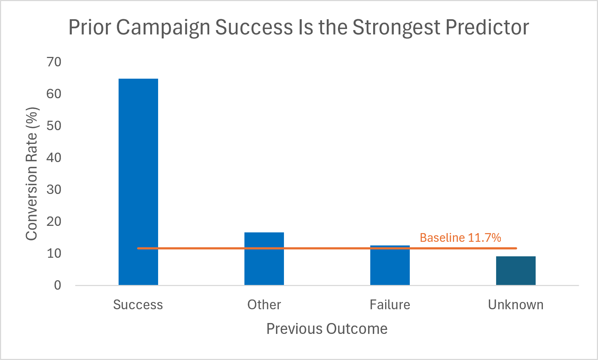
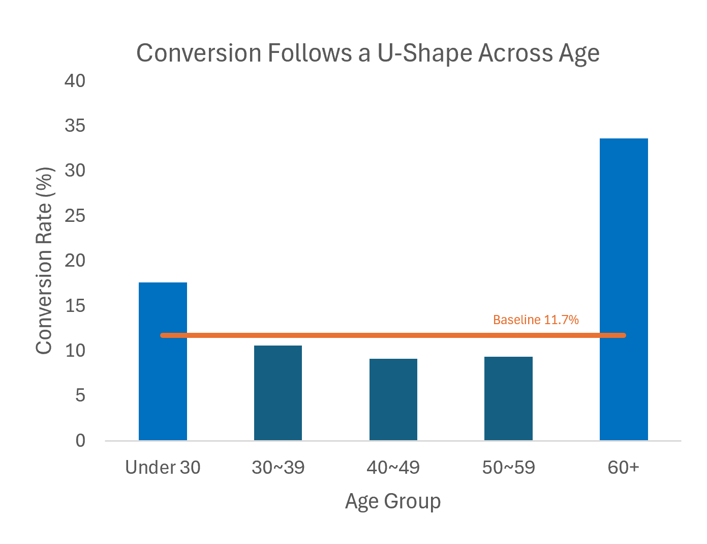
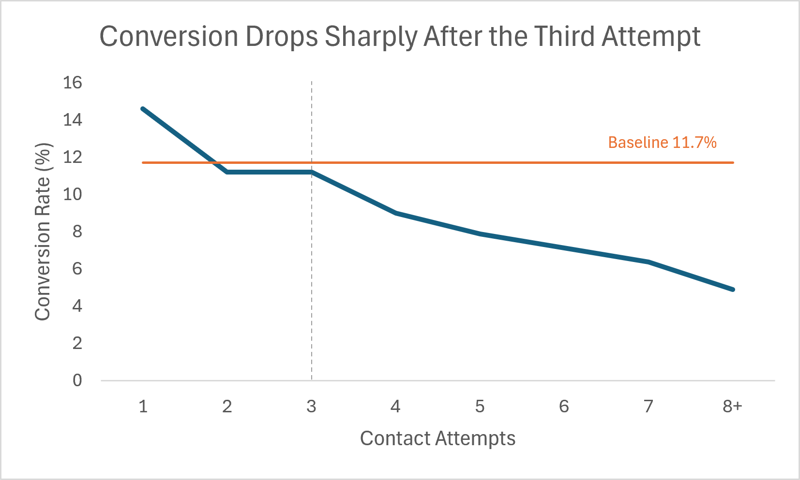

# Bank Marketing Call Targeting
### Which client segments should a call center prioritize to improve term deposit conversion?

## Business Problem

A retail bank runs outbound phone campaigns to sell term deposits. Call center
capacity is finite — every call spent on an unlikely buyer is a call not spent
on a likely one. Contacting the full client base converts at just **11.7%**,
meaning roughly 9 in 10 clients contacted do not subscribe.

This project identifies which client segments a call center should prioritize,
and when it should stop calling, to lift conversion above that baseline without
increasing headcount.

## Dataset

[UCI Bank Marketing Dataset](https://archive.ics.uci.edu/dataset/222/bank+marketing) —
45,211 clients contacted by a Portuguese retail bank between 2008 and 2010.
- **Grain:** one row = one client in this campaign
- **Contacts:** the `campaign` column records how many calls that client received
- **Target:** `y` — did the client subscribe to a term deposit?

## Tools

- **SQLite** (DB Browser) — data exploration, cleaning, and segment analysis
- **Excel** — pivot summaries and charts for the reporting layer

## Data Cleaning & Analytical Decisions

- **duration** excluded — data leakage (only known after the call; 
  predictive but not actionable for targeting).
- **poutcome** unknowns (81.75%) kept — represent new clients with no 
  prior contact, not missing data. Dropping them would remove most of 
  the dataset.
- **contact** excluded from targeting — cellular (14.9%) and telephone 
  (13.4%) convert almost identically; unknown (4.1%) likely reflects 
  early data gaps, not the channel.

## Analysis
**Baseline conversion rate: 11.7%** (5,289 subscriptions out of 45,211 clients).
Every segment below is measured against this benchmark.

| Segment | Clients | Subscriptions | Conversion | vs. baseline |
|---|---|---|---|---|
| Prior campaign success | 1,511 | 978 | **64.7%** | 5.5× |
| Age 60+ | 1,784 | 600 | **33.6%** | 2.9× |
| Age under 30 | 5,273 | 928 | 17.6% | 1.5× |
| Balance 3k–10k | 4,786 | 782 | 16.3% | 1.4× |
| *All clients (baseline)* | *45,211* | *5,289* | *11.7%* | — |
| 4+ contact attempts | 9,641 | 709 | 7.4% | 0.6× |
| Negative balance | 3,766 | 210 | 5.6% | 0.5× |

*Subscriptions = clients who converted. Conversion rate measures efficiency;
subscriptions measure volume. The two do not rank segments the same way.*

### Prior campaign success is the strongest predictor
Clients who subscribed in a previous campaign convert at **64.7%** — 5.5× the
baseline. At only 1,511 clients (3.3% of the base), this segment is small but
delivers the highest return per call.


### Conversion follows a U-shape across age
**Hypothesis:** Life-cycle theory suggests both ends of the age range favour
term deposits — retirees become risk-averse once income stops, while clients
under 30 save toward shorter-term goals.


Clients under 30 (17.6%) and over 60 (**33.6%**) both convert well above
baseline, while ages 40–50 bottom out at 9.1%. Splitting the 50+ bracket
revealed the surge begins only after 60 — ages 50–60 convert at just 9.3%,
suggesting **retirement status, not age alone**, drives the shift.

### Conversion plateaus with balance, rather than rising indefinitely
**Hypothesis:** Clients allocate by surplus level — those with modest savings
favour stable products like term deposits, while the wealthiest have capacity
for higher-yield alternatives.

Conversion climbs from 5.6% (negative balance) to 16.3% (3k–10k), then flattens:
clients holding over 10k convert at the same 16.3% despite far larger holdings.
Term deposits appeal to clients with moderate surplus, not the wealthiest.
Mid-High (3k–10k) is also the higher-volume target — 4,786 clients vs 829 above 10k.

### Age outranks balance among new clients
Among new clients (`poutcome = unknown`, 82% of the base), age dominates:
low-balance 60+ clients convert at 23.3%, beating high-balance 30–40 year olds
at 11.6%. Balance still sorts *within* each age band, but age sets the tier.
This confirms the 60+ effect is independent of prior campaign history.

### Conversion drops sharply after three contact attempts
**Hypothesis:** Repeated contact yields diminishing returns — clients who
haven't converted after several attempts are unlikely to convert at all.

The first three calls hold near baseline (14.6% / 11.2% / 11.2%), but the fourth
drops to 9.0% and continues falling to 4.9% beyond eight attempts. The 9,641 clients 
contacted more than three times yielded only 7.4% conversion.


## Key Insights

1. **Predictors form a clear hierarchy: prior outcome > age > balance.**
   Within the prior-success segment, age barely matters — conversion holds
   between 60.9% and 72.1% across every age bracket. Among new clients, age
   takes over: low-balance 60+ clients (23.3%) outperform high-balance
   30–40 year olds (11.6%). Balance sorts only within an age band. This
   ordering is what makes tiered calling work — each tier is defined by the
   strongest available signal.

2. **The highest-converting segments are also the smallest.**
   Prior-success and 60+ clients together account for 3,066 clients — just
   6.8% of the base — yielding 1,413 subscriptions. (The two segments overlap
   by 229 clients; figures are deduplicated.) Gains come from prioritization,
   not from any single segment.

3. **Term deposits fit a specific wealth band, not the wealthiest clients.**
   Conversion rises with balance but plateaus around 3k: clients holding over 10k
   convert at the same 16.3% as those holding 3k–10k, despite far larger holdings.
   Term deposits appear to serve clients with enough surplus to lock away, but not
   enough to pursue higher-yield alternatives. Chasing high-balance lists offers no
   additional lift — and Mid-High (3k–10k) carries 5.8× the client volume.

4. **A rejection is not a permanent loss — provided outreach stops in time.**
   Conversion holds near baseline through three calls (14.6% / 11.2% / 11.2%),
   then falls to 9.0% on the fourth. Yet clients who declined a *previous* campaign
   still convert at 12.6% — above the 11.7% baseline. Capping outreach at three
   attempts preserves both the client relationship and a future conversion
   opportunity, rather than exhausting it.

## Business Recommendations

### 1. Call in tiers, not at random
Work the client base in descending order of expected return. Each tier is
exhausted before moving to the next.

| Tier | Segment | Clients | Conversion |
|---|---|---|---|
| 1 | Prior campaign success | 1,511 | 64.7% |
| 2 | New clients, age 60+ | 1,243 | 27.4% |
| 3 | New clients, age under 30 | 4,297 | 14.5% |

Within each tier, prioritize clients holding 3k–10k in balance. Deprioritize
negative-balance clients (5.6%) at every tier.

### 2. Cap outreach at three attempts
Conversion holds near baseline through three calls, then falls to 9.0% on the
fourth and 4.9% beyond eight. Capping at three frees up outreach to 9,641 clients 
currently yielding 7.4% — capacity that can be redirected to Tier 1 and 2 clients.

### 3. Re-engage declined clients in the next campaign, not this one
Clients who declined a previous campaign still convert at 12.6% — above the
11.7% baseline. A rejection signals *timing*, not permanent disinterest. Rather
than exhausting these clients with a fourth or fifth call, return to them in the
following cycle.

### 4. Segment by life stage, not age bracket
The jump from 9.3% (ages 50–60) to 33.6% (60+) tracks retirement, not age
itself. Build call lists on employment status where available; age is a proxy,
not the driver.

## Impact

Working the three priority tiers first reaches **7,051 clients — 15.6% of the
base — and captures 1,941 subscriptions, or 36.7% of all conversions.**

| | Clients | Calls | Subscriptions | Per client | Per call |
|---|---|---|---|---|---|
| Untargeted (full base) | 45,211 | 124,956 | 5,289 | 11.7% | 4.2% |
| Tiers 1–3 only | 7,051 | 16,911 | 1,941 | **27.5%** | **11.5%** |

Measured per client, tiering lifts conversion **2.4×**. Measured per call — the
metric that actually maps to call center capacity — the lift is **2.7×**, since
priority-tier clients also require fewer contacts on average (2.4 calls vs 2.8).

*Note: this measures the efficiency of the targeting order, not a projected
campaign outcome. Total subscriptions still depend on how many clients the team
contacts — tiering changes whom they reach first, not whether the remaining base
converts.*

## Limitations & Next Steps

**The data is 16 years old and from a different market.** Collected in Portugal
between 2008 and 2010, immediately following the financial crisis. Retirement
ages, interest rate environments, and banking behaviour have all shifted since —
and the European retail banking system differs structurally from North America's.
These findings should be treated as a method, not a transferable conclusion.

**Correlation, not causation.** The life-cycle hypothesis explains the age
pattern, but competing explanations exist. Outbound calls are placed during
business hours — retirees are simply more available to answer than working-age
clients. The 60+ effect may partly reflect *reachability*, not *preference*.
Distinguishing the two would require call-attempt and answer-rate data.

**Contact-level outcomes are unavailable.** The `campaign` column records how
many times a client was contacted, but not which call produced the conversion.
A client with `campaign = 3` may have subscribed on the first attempt. This
makes the three-attempt cap impossible to simulate precisely — the recommendation
rests on the observed decline in conversion, not on a modelled outcome.

**Age is a proxy, not a mechanism.** Employment status, income stability, and
existing product holdings would likely explain conversion better than age
brackets alone. This dataset does not capture them.

### Next Steps

- **Validate the tiering strategy with a controlled test.** Split the call list
  and compare tiered outreach against the current untargeted approach.
- **Model conversion probability per client** rather than per segment, using the
  full attribute set (job, education, housing, loan) instead of three variables.
- **Build an interactive dashboard** so the call center can filter segments and
  rebuild lists without an analyst in the loop.

## How to Reproduce

1. Download `bank-full.csv` from the [UCI repository](https://archive.ics.uci.edu/dataset/222/bank+marketing)
2. Import into SQLite (semicolon-delimited, first row as headers)
3. Run the scripts in `sql/` in order: exploration → cleaning → analysis

The `.db` file is not committed — it can be regenerated from the CSV above.

## Repo Tree
```
bank-marketing-call-targeting/
├── data/          # UCI bank-full.csv (raw)
├── sql/           # 01_exploration → 02_cleaning → 03_analysis
├── excel/         # pivot summaries and charts
└── images/        # chart exports used in this README
```